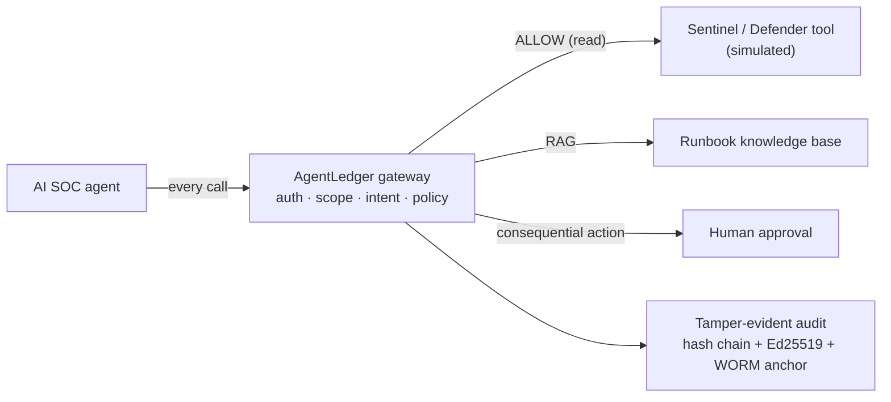

# 🛡️ AgentLedger — a security, policy & evidence layer for AI agents


> AI agents are being handed real tools — incidents, identities, endpoints — usually
> faster than anyone secures them. **AgentLedger is the security, policy and evidence
> layer around them.** Every agent gets an identity, every action passes a policy,
> every consequential action needs a human, and every execution leaves a
> tamper-evident record.

It is demonstrated as an **AI-assisted SOC triage platform**: an AI agent
investigates a Microsoft Sentinel / Defender incident, grounds its triage in your
runbooks (RAG), and recommends containment — but it can **never act alone**. The
whole project is hardened by a DevSecOps pipeline and backed by scanned Terraform.

## Architecture



The agent authenticates, is scoped and intent-bounded, and every call is policy-checked
and audited. A read is allowed; a response action (isolate a device) is **held for a
human**. Prompt injection that tries to push the agent outside its task is stopped at
the **intent** gate.

## What's inside

| Layer | What it does | Where |
|---|---|---|
| **Gateway** | one boundary: authn → scope → intent → policy → audit | `gateway/` |
| **Policy engine** | deterministic ALLOW / DENY / APPROVAL, default-deny, argument-aware | `policy/` |
| **Tamper-evident audit** | SHA-256 hash chain + Ed25519 signatures + WORM anchor | `audit/` |
| **Human approval** | consequential actions held for a person | `approvals/` |
| **Detections as code** | MITRE-mapped KQL rules + Python validator, CI-gated | `detections/` |
| **Sentinel tool** | SOC incident actions via an MCP-style tool (simulated) | `mcp_servers/sentinel_mcp.py` |
| **AI SOC agent** | investigates via the gateway, recommends, never acts alone | `soc/triage_agent.py` |
| **RAG** | runbook retrieval grounds the triage | `soc/retriever.py`, `soc/knowledge/` |
| **Infrastructure** | hardened Terraform — Storage, Key Vault, Managed Identity, NSG, Azure Policy | `infra/` |
| **Real Entra** | app-only Microsoft Graph integration | `mcp_servers/graph_mcp.py` |

## Run it

```bash
pip install -r requirements.txt
python demo_soc.py                 # end-to-end AI SOC triage demo (no cloud, no keys)

pip install -r requirements-dev.txt
python -m pytest -q                # the guarantees as tests
```

`demo_soc.py` runs one incident end to end: the agent investigates through the
gateway, grounds its triage in a runbook, recommends isolating a device — then the
isolation is blocked under the investigate intent, held for human approval under the
respond intent, and only executes once approved. Every step is signed and verifiable.

## Security & supply chain

Every push runs a hardened CI pipeline (`.github/workflows/security.yml`): **Gitleaks**
(secrets), **Bandit + CodeQL** (Python SAST), **pip-audit** (dependencies), **Grype**
(filesystem / CVEs), **Checkov** (IaC misconfiguration) and **Syft** (SBOM). The
workflow uses least-privilege `GITHUB_TOKEN` permissions and fails the build on
findings — the project stays shippable by construction. (Grype replaced Trivy after
the 2026 `aquasecurity/trivy-action` supply-chain compromise.)

## Real vs simulated

**Real / implemented:** the gateway, scope, intent, policy, human approval and
tamper-evident audit; detection-as-code and its validator; the DevSecOps pipeline;
the hardened, Checkov-scanned Terraform; and an app-only Microsoft **Entra / Graph**
integration. **Simulated for a safe, zero-cost public demo:** the Sentinel/Defender
incident data, and the Azure deployment (the Terraform is **scanned, not applied**).
The reasoning uses a deterministic rule-based engine by default; a Claude-backed
reasoner is an optional pluggable component (`soc/reasoner.py`).

> Built in public as a hands-on cloud & AI security portfolio. No production systems
> or real customer data involved.
